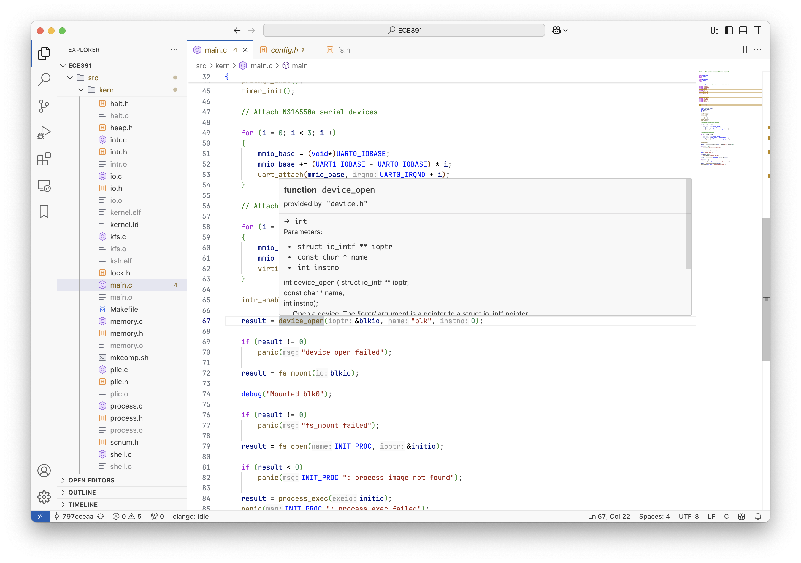

# VS Code

This is a demo for how to set up a RISC-V development environment in VS Code.
These settings will help you write, compile, and debug RISC-V code in VS Code.

## Debugging

VS Code has a built-in GUI debugger that supports GDB.
That requires several configuration files under the `.vscode` directory in the root of your project, including: [launch.json](./template/.vscode/launch.json) and [tasks.json](./template/.vscode/tasks.json).

### launch.json

The `launch.json` file specifies how to run your program, including the executable path, working directory, debugger path, and so on.
It relies on a `preLaunchTask` to indicate what commands are needed to run the program.

Check my [launch.json](./template/.vscode/launch.json) for reference.

### tasks.json

The `tasks`, including the choice for `preLaunchTask`, are defined in the `tasks.json` file.

<!-- TODO: explain tasks, and how they rely on each other -->

Check my [tasks.json](./template/.vscode/tasks.json) for reference.

## Language Server

I use [clangd extension](https://marketplace.visualstudio.com/items?itemName=llvm-vs-code-extensions.vscode-clangd)
for
- syntax checking
- code completion
- finding definitions and usages
- inlay hints

By default, it uses the `gcc` in your PATH to compile the code.
But we want to use the `riscv64-unknown-elf-gcc` instead.
So we need to create a `.clangd` file in the root directory to specify the compiler and headers to use.

We need the following flags:
1. `-xc` to specify the language as C
2. `--gcc-toolchain` to specify the path to the compiler
3. `-I` to specify the path to the headers
4. `--target=riscv-unknown-elf` to specify the target architecture

You can check my [.clangd for Linux](./resources/.clangd_linux) or [.clangd for Mac](./resources/.clangd_mac) for reference.

## Formatting

I use [clang-format](https://marketplace.visualstudio.com/items?itemName=xaver.clang-format)
to format the code.

After installing the extension, change your default formatter to `clang-format` in the settings.

The extension relies on the `clang-format` executable in your PATH.
You can install it with your package manager (e.g. `brew install clang-format` on Mac).

We also need to create a `.clang-format` file in the root directory to specify the formatting style.
You can write your own style based on my [.clang-format](./template/.clang-format).

After that, you are ready to format your code.
You can check your keymaps for the format command in the `Keyboard Shortcuts` settings.
Press `Ctrl+K` then `Ctrl+S` (or `Command+K` then `Command+S`) to open the settings and search for `format`.

Press that key combination in your .c or .h files to format the code.