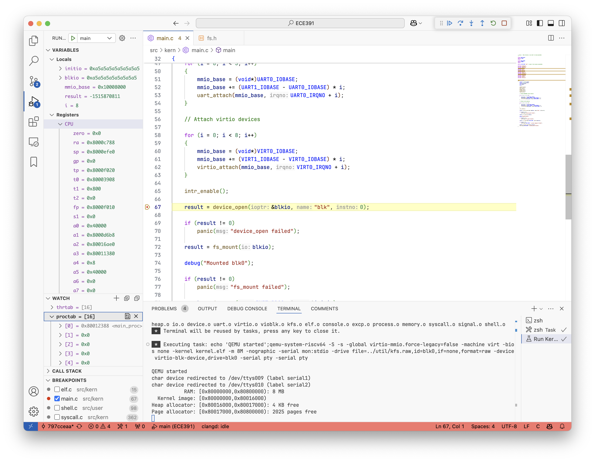
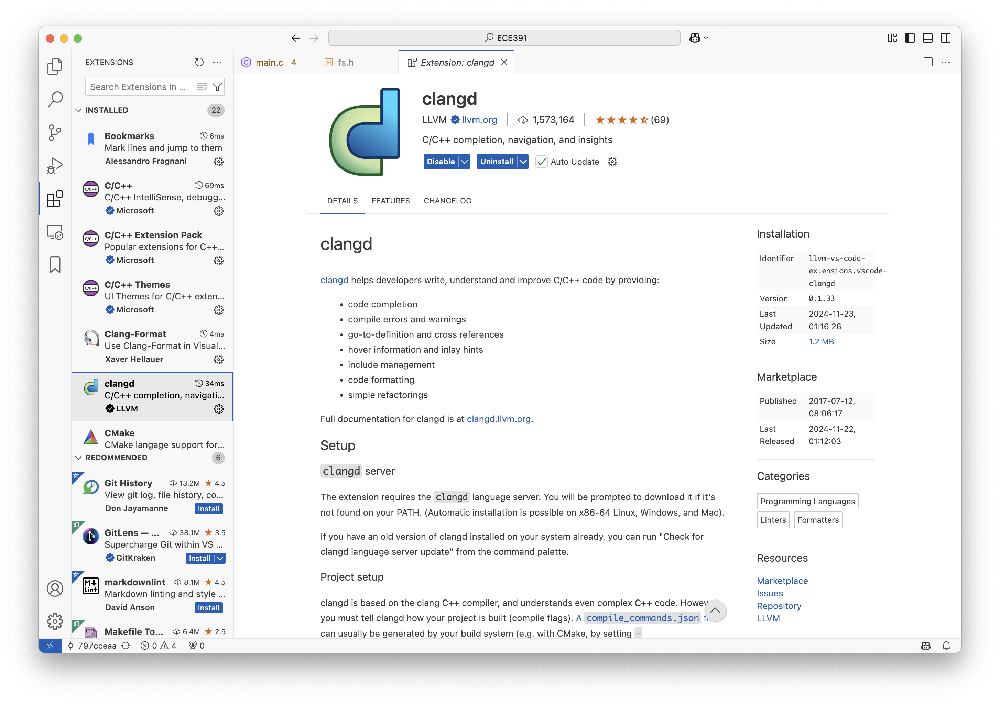
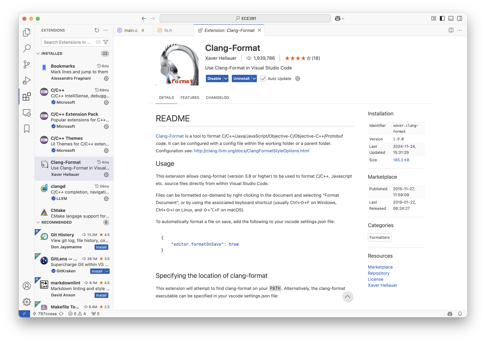
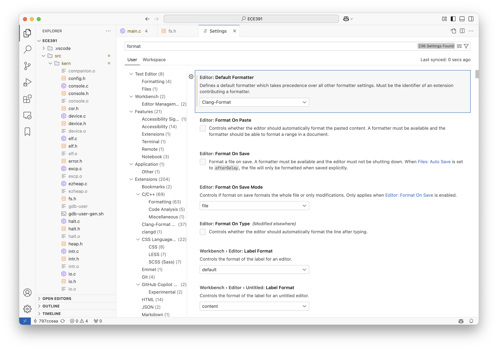
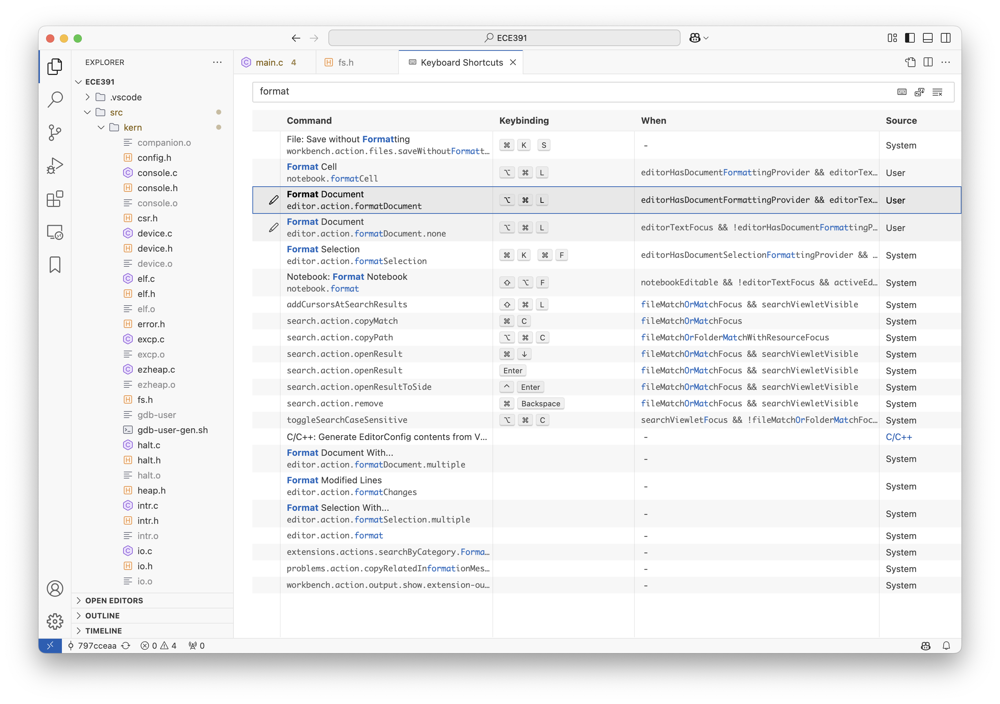

# VS Code Configuration

This is a demo for how to set up a RISC-V development environment in VS Code.
These settings will help you write, compile, and debug RISC-V code in VS Code.

You can check my [template project](./template/) for complete examples,
for [MP1](./template/mp1/) and [MP3](./template/mp3/).

## Debugging



VS Code has a built-in GUI debugger that supports GDB.
That requires several configuration files under the `.vscode` directory in the root of your project, including: [launch.json](./template/mp3/.vscode/launch.json) and [tasks.json](./template/mp3/.vscode/tasks.json).

With these configurations, you can:
1. Compile and run your program with a single click in the `run and debug` panel.
2. Set breakpoints and step through your code.
3. Inspect runtime values of variables and registers.

### Assembly Debugging

To enable debugging in assembly, make sure `-g` is included in your `ASFLAGS` in the Makefile.

Add the following line to your Makefile, if it is not already there:

```makefile
ASFLAGS += -g
```

Check my [Makefile](./template/mp1/Makefile) for reference.

### launch.json

The `launch.json` file specifies how to run your program, including the executable path, working directory, debugger path, and so on.
It relies on a `preLaunchTask` to indicate what commands are needed to run the program.

In my [launch.json](./template/mp3/.vscode/launch.json), the snippet defines a debug configuration
called `main` for the kernel.
It will execute the `Run Kernel` task before launching the debugger.

```json
{
    "name": "main",
    "type": "cppdbg",
    "request": "launch",
    "program": "${workspaceFolder}/src/kern/kernel.elf",
    "cwd": "${workspaceFolder}/src/kern",
    "miDebuggerPath": "riscv64-unknown-elf-gdb",
    "miDebuggerServerAddress": "localhost:1234",
    "preLaunchTask": "Run Kernel"
},
```

### tasks.json

The `tasks`, including the choice for `preLaunchTask`, are defined in the `tasks.json` file.

In my [tasks.json](./template/mp3/.vscode/tasks.json), each task is a set of commands to run.
You can give each task a `label` and a `command` to run.
The `cwd` option specifies the working directory for the command.

The `dependsOn` option specifies other tasks that need to be run before this one.
When you run the task, it will automatically run the tasks listed in `dependsOn` first.

```json
{
    "label": "Build Kernel",
    "type": "shell",
    "command": "make",
    "args": [
        "all",
        "-j"
    ],
    "group": {
        "kind": "build",
        "isDefault": true
    },
    "problemMatcher": [
        "$gcc"
    ],
    "options": {
        "cwd": "${workspaceFolder}/src/kern"
    },
    "dependsOn": [
        "Clean Kernel"
    ]
},
```

## Language Server


I use [clangd extension](https://marketplace.visualstudio.com/items?itemName=llvm-vs-code-extensions.vscode-clangd)
for
- syntax checking
- code completion
- finding definitions and usages
- inlay hints



By default, it uses the `gcc` in your PATH to compile the code.
But we want to use the `riscv64-unknown-elf-gcc` instead.
So we need to create a `.clangd` file in the root directory to specify the compiler and headers to use.

We need the following flags:
1. `-xc` to specify the language as C
2. `--gcc-toolchain` to specify the path to the compiler
3. `-I` to specify the path to the headers
4. `--target=riscv-unknown-elf` to specify the target architecture

You can check my [.clangd for Linux](./resources/.clangd_linux) or [.clangd for Mac](./resources/.clangd_mac) for reference.

## Formatting

I use [clang-format](https://marketplace.visualstudio.com/items?itemName=xaver.clang-format)
to format the code.



After installing the extension, change your default formatter to `clang-format` in the settings.



The extension relies on the `clang-format` executable in your PATH.
You can install it with your package manager (e.g. `brew install clang-format` on Mac).

We also need to create a `.clang-format` file in the root directory to specify the formatting style.
You can write your own style based on my [.clang-format](./template/mp3/.clang-format).

After that, you are ready to format your code.
You can check your keymaps for the format command in the `Keyboard Shortcuts` settings.
Press `Ctrl+K` then `Ctrl+S` (or `Command+K` then `Command+S`) to open the settings and search for `format`.



Press that key combination in your .c or .h files to format the code.